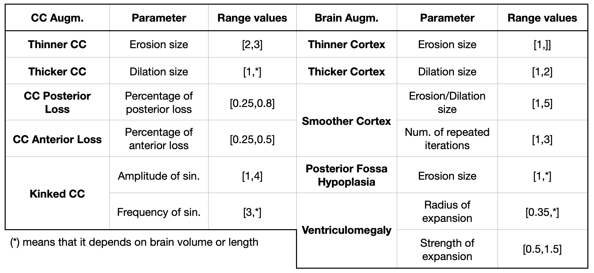

## AUGMENTATION PIPELINE DETAILED EXPLANATION

The **main contribution** of this project to the FetalSynthSeg framework is the **integration of anatomical alteration simulations to improve model performance on pathological cases.** This modification is applied immediately after the generation of meta-labels and intensity cluster seeds within the FetalSynthSeg pipeline.

Given the structure of the framework, each subject requires two consistently altered images: the original segmentation and its corresponding seed (intensity cluster) image. The two paired images must be modified equally to ensure proper alignment for domain randomization (DR), as the synthetic intensity image is generated directly from the seed and must remain consistent with the original segmentation.

However, in its original form, the corpus callosum (CC) is grouped under the white matter (WM) meta-label and, thus, it cannot be distinguished from WM in the seed image. To address this, we extract the CC from the segmentation and generate a mask to identify its corresponding region in the intensity image. Alterations to the CC label are then applied selectively to this masked region, ensuring that the CC is modified independently of the surrounding WM.

Disclaimer: The goal of this work is not to precisely replicate CC alterations or specific pathologies in a clinically realistic manner. Instead, following the principles of domain randomization, we try to generate a wide variety of anatomical variations, guided by both the CCD classification sketches and real cases, to cover a broad spectrum of possibilities and combinations. The underlying assumption is that, by exploring this wide range, we increase the likelihood of also capturing the reality.

Although the alterations are not designed to precisely replicate clinical pathologies, they have been reviewed and refined in consultation with neuroradiologists to ensure they represent plausible, anatomically realistic variations and co-occurring abnormalities.

The goal of the proposed simulations is **to establish a flexible framework with adjustable parameters, enabling the generation of a wide spectrum of anatomical variations** for each type of alteration, ranging from subtle to extreme cases, aligning with the idea of domain randomization. To define these parameter ranges, we simulate multiple altered images for the whole range of gestational ages and visually identify the realistic boundaries of variability. Some of them, which are influenced by brain size or volume, will be scaled accordingly to ensure that variations in gestational age are taken into account, as they can lead to significant differences in the brain and, consequently, CC dimensions.

There are two preprocessing steps applied before any CC alterations:

* **Biggest Connected Component**
  The initial step in the CC alteration pipeline is to isolate the CC as its largest connected component to ensure that subsequent alterations are performed on a topologically consistent structure. The remaining minor components are re-labeled using Nearest Neighbour (NN) interpolation to fill the gaps with adjacent tissue labels.

* **Base images**
  Many of the alterations consist of a thinner or shorter CC. This raises the issue of how to handle the region previously occupied by the CC, which becomes empty after the alteration. Based on expert recommendations, we fill this space with cerebrospinal fluid (CSF), applying the change consistently to both the segmentation and seed. Therefore, these modified images then serve as the base upon which the modified CC is reinserted.

After applying the alterations (detailed in the sections on CC and brain alterations), the biggest connected component post-processing step is applied. To compute biggest connected components, 26-connectivity is used.

### Corpus Callosum Anatomy Alteration Simulations

Based on the sketches and the classification from previous research, and discussed with expert neuroradiologists, we identified the broad alteration patterns to design five distinct anatomical alteration simulations. As emphasized earlier, our goal is not to perfectly replicate each pathology but to capture representative variation; therefore, these five general categories will be enough for the purpose of this project.

Among the various types of corpus callosum dysgenesis (CCD), we chose to exclude dysplasia without hypoplasia, as two independent experts concurred that it is not a common type and we have no data to evaluate it. In our simulated cohort, the rest of the alterations are randomly generated given a uniform distribution with probability 0.2.

All anatomical alterations are performed directly in 3D to maintain spatial coherence.


Here’s your text converted into plain, clean text with all LaTeX formatting and footnotes removed:

**Agenesis of the CC (CCA)**
This simulation is straightforward. Since we already have the nearest-neighbour (NN) interpolated images, where the corpus callosum (CC) is replaced by the expansion of its neighbouring tissues, we simply use these images with no additional modifications required.
Thus, this alteration doesn't require any parameters—only a boolean variable indicating that agenesis has been simulated.

**Thinning of the CC**
This alteration applies a binary erosion operation to obtain the eroded mask using a 3D vertical line structuring element (a binary kernel of shape (1, size, 1)). This specific shape was selected after evaluating several alternatives and was found to generate the most consistent results, better preserving the CC as a single connected component. If this is not achieved, a post-processing step is applied after erosion to retain only the largest connected component, ensuring topological correctness.
The final step uses the resulting mask to extract the eroded CC from the original seed and reinsert it into the base seed image. The same mask is also used to update the segmentation image, assigning the CC label to maintain consistency across both representations.
This alteration requires defining a range for the length of the vertical line, which is set to \[2, 3]. It does not depend on any other measure, as this range works across all gestational ages.

**Thickening of the CC**
This alteration uses binary morphological dilation with a ball-shaped structuring element, chosen for its more uniform impact on the result. However, intensities are more complex to handle, as the CC mask may contain multiple intensities.
To manage this, we first obtain the expanded segmentation mask as a reference and then use NN interpolation to extend the intensities of the CC intensity mask to fill the entire space defined by the expanded mask. Finally, the modified regions are reinserted on top of the base segmentation and seed images.
The maximum dilation is defined relative to brain volume to ensure proportionality across subjects. The minimum of the range is set to 1.

**Partial loss of the CC**
This alteration simulates two different scenarios, chosen randomly unless otherwise specified: anterior and posterior loss. The modification is defined along the y-axis, which corresponds to the anterior–posterior length of the CC.

* **Posterior loss**
  A partial mask is created that includes only the voxels up to a specified proportion of the CC length, calculated as: minimum y-coordinate plus percentage of total length, removing the posterior portion of the CC.
  The range for the percentage of posterior loss is set between 0.25 and 0.8. Since it's a percentage of the subject’s CC length, no other conditions are required.

* **Anterior loss**
  A partial mask is created that includes only the voxels from the smallest y-coordinate up to a calculated threshold: minimum y-coordinate plus percentage of total length, keeping only the posterior portion.
  The range for the percentage of anterior loss is set between 0.2 and 0.5.

Once the partial mask is defined, the corresponding region is extracted from the seed image and inserted into the base seed image. The same mask is then used to update the segmentation image, assigning the CC label to the modified region to maintain anatomical consistency.

**Kinked**
This alteration simulates a kinked CC—a smooth, wave-like deviation along the x-axis. The deformation is restricted to a region of interest (ROI), defined as the smallest 3D bounding box that fully contains the CC. The wave effect is created by applying a sinusoidal displacement to the x-coordinates of the ROI based on their y-positions, using the following transformation:

```
x_warped = x + amplitude * sin(frequency * y)
```

The frequency controls the number of waves, and the amplitude determines the height. The warped coordinate grid is then used to resample both the segmentation and seed volumes, applying the deformation only within the ROI.
This alteration requires defining two parameter ranges. The amplitude of the sinusoidal transformation is set to \[1, 4] and does not depend on other measures. The frequency range is adjusted based on brain length to keep it proportional across subjects, with a minimum value of 3.


### Brain Anatomy Alteration Simulations

As mentioned earlier, we also simulate specific central nervous system (CNS) anomalies associated with corpus callosum dysgenesis (CCD). Incorporating these variations is expected to significantly improve CCD segmentation performance. The alterations are applied with a probability of 0.6 for ventriculomegaly and 0.1 for each of the remaining alterations.
All anatomical alterations are performed directly in 3D to maintain spatial coherence.


**Thicker Cortex**
This cortical malformation simulates a thicker cortex in the interior of the brain, keeping the exterior regions unchanged. The thickening is done by dilating the cortex region, but restricting its expansion to only affect the white matter (WM), leaving the cerebrospinal fluid (CSF) intact.
To handle the intensity values, nearest-neighbour (NN) interpolation is used to extend the cortex intensities into the newly expanded space. Finally, the expanded intensities are inserted into the base seed image, and the updated mask is added to the base segmentation image.
The size of the structuring element used for dilation (a ball shape) is selected randomly within a fixed range of \[1, 2], regardless of brain size.


**Thinner Cortex**
This cortical malformation simulates a thinner cortex, again affecting only the interior. Because the cortex can be very thin, directly applying erosion might not be effective. Instead, we simulate thinning by expanding the CSF region, but only into the cortex, achieving a similar effect in a more controlled way.
First, the CSF region is dilated, and this expansion is limited to the cortex region. NN interpolation is then used to extend CSF intensities into the newly defined area. The modified intensities are inserted into the base seed image, and the new mask is added to the segmentation.
The size of the structuring element (a ball) used for CSF expansion is a random parameter. The minimum is set to 1, and the maximum is determined based on the subject's brain volume.

**Smoother Cortex**
This malformation aims to smooth the external surface of the cortex by applying a sequence of dilations and erosions to the cortex mask. This operation reduces the typical cortical folds, resulting in a smoother, slightly thicker cortex.
The process starts with several iterations of dilation followed by the same number of erosions. To ensure only the outer cortex is affected, the modification is restricted to the outer boundary, preserving the white matter. NN interpolation is used to fill in the new intensities, and these are then inserted into the base seed image. The segmentation is also updated with the correct cortex label to maintain consistency.
Two random parameters are used: the size of the structuring element (ball), ranging from 1 to 5, and the number of iterations, ranging from 1 to 3.


**Brainstem and Cerebellum Hypoplasia**
This simulation targets a posterior fossa abnormality, specifically hypoplasia of the brainstem and cerebellum. Direct erosion of these regions risks disconnecting them from surrounding structures, so a more robust method is used.
A mask is first created for all tissues except CSF and background. This combined mask is eroded as a whole to preserve connectivity between structures.
Next, in the base segmentation image, the brainstem and cerebellum regions are replaced with CSF, which surrounds them. NN interpolation is used to replace their intensities with those of neighbouring tissue. Finally, the eroded tissue intensities are inserted into the base seed image, and the eroded tissue mask is inserted into the segmentation.
The size of the structuring element (a ball) used for erosion is a random parameter. The minimum is set to 1, and the maximum is adjusted based on brain volume.


**Ventriculomegaly**
Ventriculomegaly is the dilation of the ventricles, although it is not a uniform dilation across all the ventricle tissue. We need to simulate a localized radial expansion, which means we want to simulate a balloon effect, altering the surrounding geometry by stretching the ventricle tissue outwards and, consequently, compressing the surrounding tissues. To obtain this simulation, we create a spatial transformation using a flow-field grid. In this, we will simulate the radial expansion based on three parameters: center, radius and strength. It is defined as:

\[
f(d) = 
\begin{cases}
1 - s \left(\frac{R - d}{R}\right)^2 & \text{if } d < R \\[6pt]
1 & \text{if } d \geq R
\end{cases}
\]


where d is the distance from a voxel to the center, R is the radius of the expansion effect, s the strength (in range \[0,1]) and f(d) is the radial expansion factor at distance d.

With this, we obtain a radial expansion only inside the radius of effect and, the closer to the center, the stronger the push. Therefore, at the center d=0: f(0)=1-s which is the maximum expansion. These effect decreases smoothly and non-linearly as distance increases and at the edge of the radius d=R: f(R)=1, which means no expansion.

The grid contains, for every output voxel, the coordinate in the input tensor from which to sample and it uses NN interpolation, in order to keep the discrete labels intact. It basically moves each voxel coordinate towards the exterior by multiplying the distance by the computed factor.

Given the grid definition, and the three parameters, we just need to apply the expansion grid simulation to the segmentation and the seed and obtain the final result.

Each hemisphere contains a lateral ventricle, and ventriculomegaly often presents asymmetry, rather than affecting both ventricles equally or only one. To reflect this, our simulation includes randomized parameters not only for the expansion radius and intensity, where the radius maximum is based on brain volume and the minimum set at 0.35 and the strength varies within the \[0.5, 1.5], but also for lateralization. Specifically, ventriculomegaly can affect the left, right, or be bilateral, with a defined range of probabilities of 0.2, 0.2, and 0.6, respectively.

Once the lateralization is determined, the next step involves selecting the center point of the ventricular expansion. This is done by first identifying valid candidate locations within the ventricle. To achieve this, we apply a Signed Distance Transform (SDT) to the ventricle mask, retaining only those voxels that are at least 4 voxels deep from the boundary. This ensures that the expansion originates from the interior of the ventricle, avoiding boundary voxels that could unintentionally also involve adjacent tissues. The resulting set of valid points is then divided into left and right hemispheres, and one point is randomly selected based on the target lateralization.

With this randomization of the center, we are also taking into account the posterior horns as valid expansion centers and, therefore, we will also be simulating colpochepaly. Additionally, as a consequence of the expansions we are simulating, we will also be compressing the neighbouring tissues, favoring the reduction of white matter, which contributes to the modeling of white matter anomalies.


This is a summary table for all the ranges used across the different augmentations in the pipeline:
