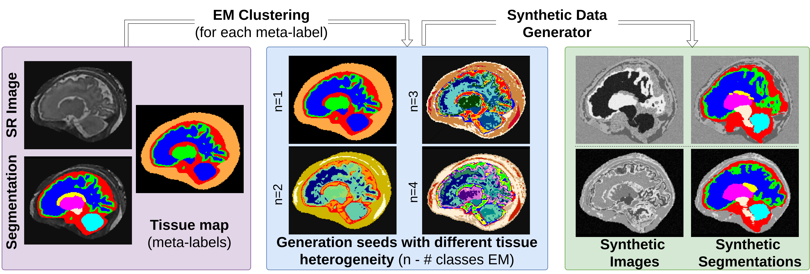

# FetalSynthGen [](https://github.com/Medical-Image-Analysis-Laboratory/fetalsyngen)


## Introduction
FetalSynthGen is a **synthetic data generator** created to address the challenges of limited data and domain shifts in fetal brain MRI analysis. It is based on the **domain randomization** approach of SynthSeg [1], which uses anatomical segmentations to create diverse synthetic images.

It's application for fetal brain tissue segmentation is described in [2, 3].

Below is a brief overview of the key components of the FetalSynthGen pipeline:


*   **Input:** The generator begins with a dataset of segmentation maps, which serve as anatomical priors of the simulated fetal brain.

*  **Meta-Labels:** Instead of directly using the original segmentation labels, the method first merges these labels into four **meta-classes**: white matter (WM), gray matter (GM), cerebrospinal fluid (CSF), and non-brain tissue (including skull and surrounding maternal tissue).

*   **Intensity Clustering:** Within each meta-class, the generator uses the Expectation-Maximization (EM) algorithm for intensity clustering, which divides each meta-class into **subclasses**, capturing the heterogeneity of the simulated brain tissues. The number of subclasses is sampled from a random uniform distribution.
*   **Intensity Generation:** For each subclass, the generator then samples intensities from a **Gaussian Mixture Model (GMM)** with randomized parameters. This method creates images with varied contrasts that although often exceed what is realistic, ensure that the model learns features robust to  domain shifts related to intensity or contrast.
*   **Spatial Transformations:** After generating intensities, the synthetic images undergo spatial transformations, including affine and non-rigid diffeomorphic deformations. These simulate variations in image resolution and partial volume effects.
*    **Artifact Simulation**: The generator corrupts the images by adding a bias field, performing intensity transformations, and simulating various image resolutions.

<!-- The use of **meta-labels** and **subclasses** prevents artificial boundaries from aligning with the segmentation boundaries in the synthetic images.The goal of FetalSynthGen is to produce highly varied and diverse synthetic images, covering the range of variations that would be encountered across different real-world domains. -->

The output of the generator is a paired set of **synthetic images** and corresponding **synthetic segmentations** that can be used to train a segmentation model, super-resolution or brain-embedding model.

## Installation

### From Source
```bash
git clone https://github.com/Medical-Image-Analysis-Laboratory/fetalsyngen
cd fetalsyngen
pip install -e .
```

## Acknowledgements

This research was funded by the Swiss National Science Foundation (182602 and 215641), ERA-NET Neuron MULTI-FACT project (SNSF 31NE30 203977). We acknowledge the Leenaards and Jeantet Foundations as well as CIBM Center for Biomedical Imaging, a Swiss research center of excellence founded and supported by CHUV, UNIL, EPFL, UNIGE and HUG.

## References
1. Billot, Benjamin, et al. “SynthSeg: Segmentation of Brain MRI Scans of Any Contrast and Resolution without Retraining.” Medical Image Analysis, vol. 86, 25 Feb. 2023, pp. 102789–102789, www.sciencedirect.com/science/article/pii/S1361841523000506, https://doi.org/10.1016/j.media.2023.102789.
2. Vladyslav Zalevskyi, et al. “Improving Cross-Domain Brain Tissue Segmentation in Fetal MRI with Synthetic Data.” Lecture Notes in Computer Science, 1 Jan. 2024, pp. 437–447, link.springer.com/chapter/10.1007/978-3-031-72378-0_41, https://doi.org/10.1007/978-3-031-72378-0_41. 
3. Vladyslav Zalevskyi, et al. “Maximizing Domain Generalization in Fetal Brain Tissue Segmentation: The Role of Synthetic Data Generation, Intensity Clustering and Real Image Fine-Tuning.” ArXiv.org, 2024, arxiv.org/abs/2411.06842.


‌
‌

‌