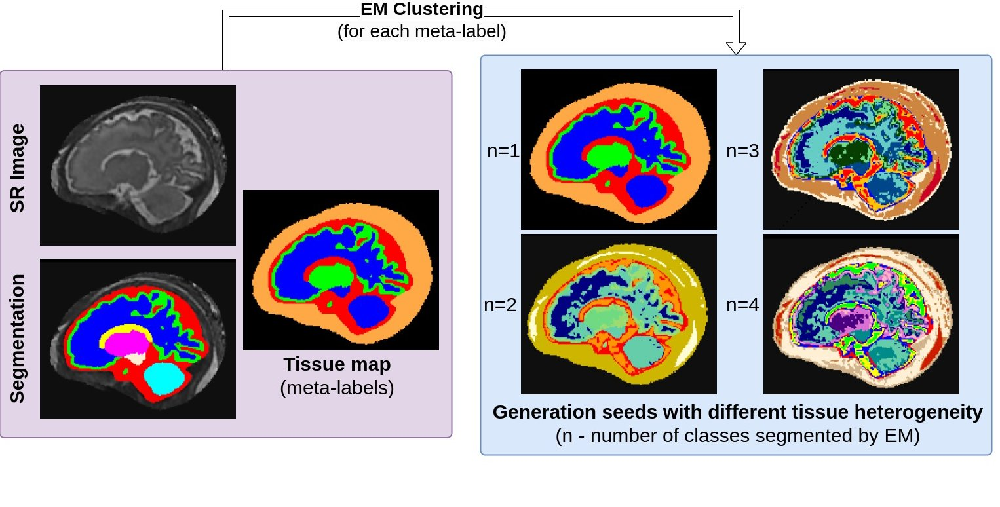

# Seed Generation

## Introduction
Seed generation is an intermediate step in creating synthetic fetal brain MRI images with FetalSynthGen.

* It addresses the **limited number of segmentation classes** in fetal brain MRI.
* It allows the simulation of **finer variations** in tissue data.
* It reduces reliance on **artificial contrast** between segmentation labels and instead focuses on simulating anatomical variability within tissue types, helping to **prevent models from learning label-specific contrast boundaries** that may not exist in real images, which can be a problem with super-resolution MRI.

**How is it performed?**

*   First, **original segmentation labels are merged into four meta-labels**: cerebrospinal fluid (CSF), white matter (WM), gray matter (GM), and non-brain tissue (skull and surrounding tissue).
*   Then, the **Expectation-Maximisation (EM) algorithm** is used for **intensity clustering** within each meta-label.
*   This process divides each meta-label into a **random number of subclasses**, from one to four. These subclasses become the basis for generating synthetic images.
*   Later in the generation pipeline, a **Gaussian Mixture Model (GMM)** is sampled for each subclass, and is used to sample intensities for voxels inside of it.

This process ensures the synthetic images better reflect the heterogeneous nature of fetal brain tissue and the variability seen in real MRI data. See figure below for an example of seed generation.

 

## Usage
The script `fetalsyngen/scripts/generate_seeds.py` is used to generate seeds for the FetalSynthGen pipeline.

``generate_seeds.py [-h] --bids_path BIDS_PATH --out_path OUT_PATH [--max_subclasses MAX_SUBCLASSES] --annotation {feta,dhcp}``

```text
options:
  -h, --help            show this help message and exit
  --bids_path BIDS_PATH
                        Path to BIDS folder with the segmentations and images for seeds generation
  --out_path OUT_PATH   Path to save the seeds
  --max_subclasses MAX_SUBCLASSES
                        How many subclasses to simulate for each tissue type (meta-label)
  --annotation {feta,dhcp}
                        Annotation type. Should be either 'feta' or 'dhcp'

Example: python generate_seeds.py --bids_path /path/to/bids --out_path /path/to/out --max_subclasses 10 --annotation feta
```

**Note:**

* The `--annotation` flag specifies the type of segmentation labels to use. The `feta` option uses the [FeTA Challenge](https://fetachallenge.github.io/) labels, while the `dhcp` option uses the [`Developing Human Connectome Project (dHCP)`](https://biomedia.github.io/dHCP-release-notes/) labels as they have different segmentation classes.


## Output Format
The output seeds are saved as `int8` NIfTI files, with the same dimensions as the input images to speed up the seed loading process during generation.

The output folder structure is as follows:

```python
├── derivatives
│   ├── seeds
│   │   └── subclasses_{1-max_subclasses}
│   │       └── sub-sta30
│   │           └── anat
│   │               └── sub-sta30_rec-irtk_T2w_dseg_mlabel_{1-4}.nii.gz
└── sub-sta30
   └── anat
       ├── sub-sta30_rec-irtk_T2w_dseg.nii.gz
       └── sub-sta30_rec-irtk_T2w.nii.gz
```