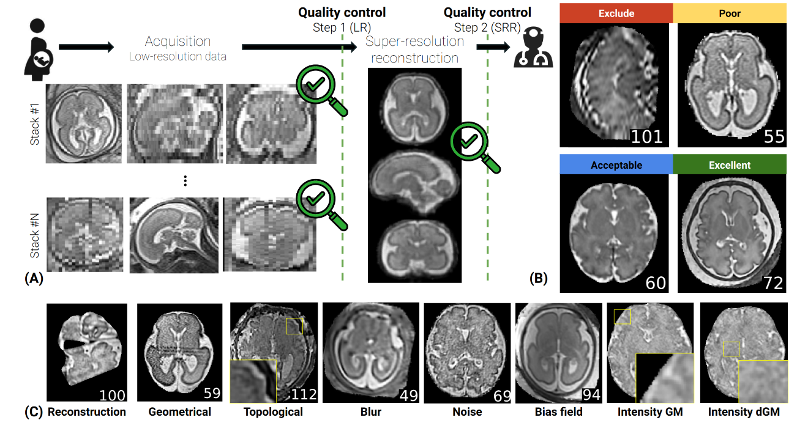

# Super-resolution artifacts

Super-resolution reconstruction algorithms are used commonly in fetal MRI imaging to improve the resolution of the images, due to specifics of fetal (brain) MRI acquisitions (see figure below [1]).
<br></br>

<!-- add cation to the image -->
<center>*Fig. 1. **(A)** Illustration of the data acquisition and reconstruction in fetal brain MRI. Stacks of 2D images are acquired at multiple orientations and combined into a single 3D volume using super-resolution reconstruction techniques. Quality control checks are implemented on the stacks of 2D images (Step 1) and on the SRR volume (Step 2). **(B)** SRR volumes with different quality scores. **(C)** Example of the different SR artifacts*</center>


We implemented a SR artifact simulation framework to generate synthetic fetal brain MRI images with different types of artifacts.
To enable it, simply pass corresponding classes described below to the [generator class](generation.md#fetalsyngen.generator.model).

You can see examples of its application in the following [notebook](https://github.com/Medical-Image-Analysis-Laboratory/fetalsyngen/blob/a671486b9bf342a80b01ecbbde15976cfffa2fe1/examples/sr_artifacts_test.ipynb). It consists of following classes that each implement a specific type(s) of artifacts:

## Cortex blur
Default configuration:
```yaml
blur_cortex:
  _target_: fetalsyngen.generator.augmentation.artifacts.BlurCortex
  prob: 0.4
  cortex_label: 2
  nblur_min: 50
  nblur_max: 200
  sigma_gamma_loc: 3
  sigma_gamma_scale: 1
  std_blur_shape: 2
  std_blur_scale: 1
```

::: fetalsyngen.generator.augmentation.artifacts.BlurCortex
    options:
      show_root_heading: true
      heading_level: 3

## Skull stripping artifacts
Default configuration:
```yaml
  _target_: fetalsyngen.generator.augmentation.artifacts.SimulatedBoundaries
  prob_no_mask: 0.5
  prob_if_mask_halo: 0.5
  prob_if_mask_fuzzy: 0.5
```
::: fetalsyngen.generator.augmentation.artifacts.SimulatedBoundaries
    options:
      show_root_heading: true
      heading_level: 3
## Structural noise
Default configuration:
```yaml
struct_noise:
  _target_: fetalsyngen.generator.augmentation.artifacts.StructNoise
  prob: 0.4
  wm_label: 3
  std_min: 0.2
  std_max: 0.4
  nloc_min: 5
  nloc_max: 15
```
::: fetalsyngen.generator.augmentation.artifacts.StructNoise
    options:
      show_root_heading: true
      heading_level: 3

## Artifacts related to the wrong fetal motion estimation during SR reconstruction
Default configuration:
```yaml
simulate_motion:
  _target_: fetalsyngen.generator.augmentation.artifacts.SimulateMotion
  prob: 0.4
  scanner_params:
    _target_: fetalsyngen.generator.artifacts.utils.ScannerParams
    resolution_slice_fac_min: 0.5
    resolution_slice_fac_max: 2
    resolution_slice_max: 1.5
    slice_thickness_min: 1.5
    slice_thickness_max: 3.5
    gap_min: 1.5
    gap_max: 5.5
    min_num_stack: 2
    max_num_stack: 6
    max_num_slices: 250
    noise_sigma_min: 0
    noise_sigma_max: 0.1
    TR_min: 1
    TR_max: 2
    prob_gamma: 0.1
    gamma_std: 0.05
    prob_void: 0.2
    slice_size: null
    restrict_transform: False
    txy: 3.0

  recon_params:
    _target_: fetalsyngen.generator.artifacts.utils.ReconParams
    prob_misreg_slice: 0.08
    slices_misreg_ratio: 0.1
    prob_misreg_stack: 0.08
    txy: 3.0
    prob_merge: 0.8
    merge_ngaussians_min: 2
    merge_ngaussians_max: 4
    prob_smooth: 0.2
    prob_rm_slices: 0.3
    rm_slices_min: 0.1
    rm_slices_max: 0.4

```

::: fetalsyngen.generator.augmentation.artifacts.SimulateMotion
    options:
      show_root_heading: true
      heading_level: 3


## References
1. Sanchez, Thomas, et al. "Assessing data quality on fetal brain MRI reconstruction: a multi-site and multi-rater study." International Workshop on Preterm, Perinatal and Paediatric Image Analysis. Cham: Springer Nature Switzerland, 2024.